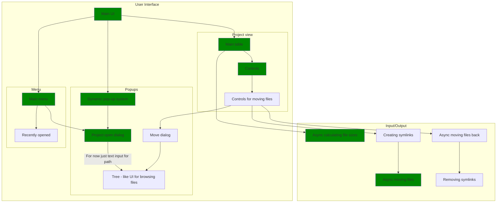

# Moverr

Tired of manually moving your games between drives or uninstalling them once you
run out of space? Moverr is a simple tool that lets you move huge folders between
drives and create symbolic links to the original location.

This way you can keep your games installed and play them without having to worry
about running out of space.
It should work for any folder, but it was designed with games in mind.
It can replace tools like SteamMover.

File system operations are running in a separate thread, so you can keep using the
application while it's moving files and see the progress in real time.

:warning: **Warning**: This tool is still in early development and is
***not usable*** just yet.

## Usage

Run the application. This should show a simple TUI interface. You can access the
main menu by pressing `Esc`. From there, by using `File`›`Open`, you can select
the directory in which your games are installed.
Then, all your games should be listed in the main view.

## Current state

